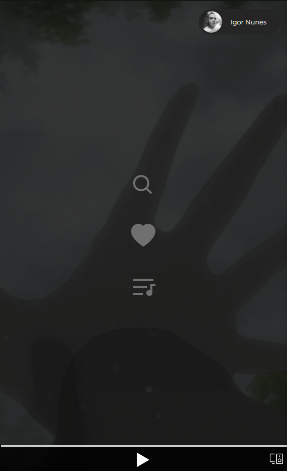
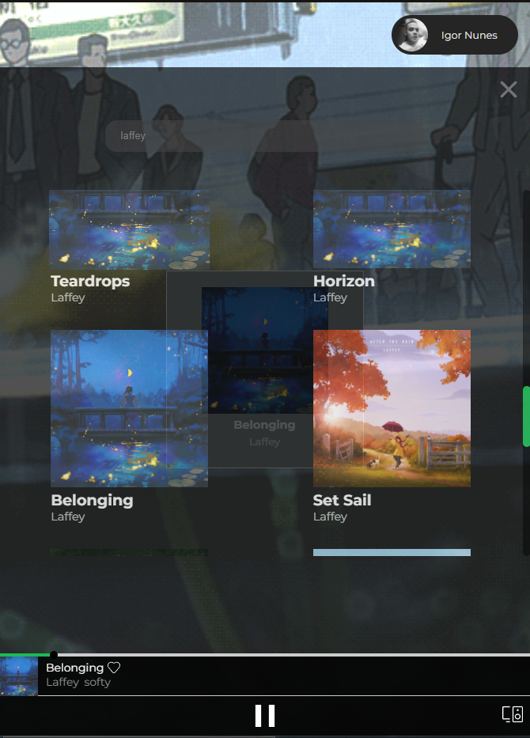

# ANIMEFY

## Introdução

Esse é um projeto que utiliza a API do Spotify para músicas e uma API para geração de Gifs de cenários de anime. Nele você consegue ouvir suas músicas da sua conta do Spotify enquanto gifs de Cenários animados são mostrados ao fundo, gerados aleátoriamente a cada mudança de música. 

    
    
     

## Features

- Você pode buscar qualquer música/artista disponivel no Spotify.
- Toca-la ao seleciona-la no menu de busca.

## Próximas Features
- *Abrir suas playlists e tocar.*
- *Abrir todas as músicas que você curtiu e tocar.*
- *Melhorar qualidade dos gifs, (talvez eu que tenha que criar cada um deles😔)*
- *Manter sessão do usuário sempre logada, refreshToken*

## Como utilizar

Basta entrar no [animefy](https://aniimefy.herokuapp.com/login) e realizar o login na sua conta do Spotify. 💚

